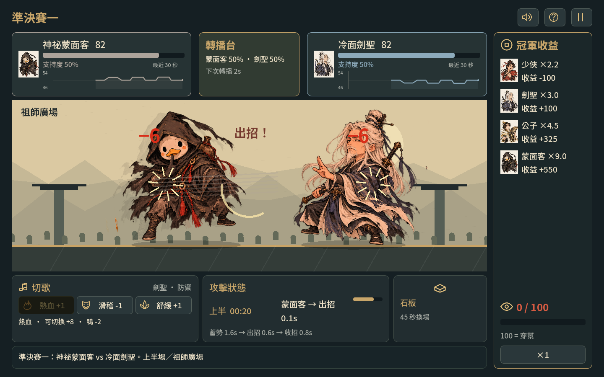

# 笑嗷江糊：不講武德大會

可玩的單人 2D 策略喜劇課程原型，使用 **Godot 4.7.2 stable / GDScript / Compatibility** 製作。

你坐在武林大會的導播席，安排四名選手的單淘汰賽，再利用音樂、轉播與場地，讓結果導向較高收益，同時避免觀眾揭穿黑箱。

[直接在 itch.io 遊玩](https://cdytim630.itch.io/laughing-jianghu) · [下載試玩包與原始碼](https://github.com/CdyTim630/laughing-jianghu-godot/releases/latest)

## 開始遊玩

- 無須安裝 Godot：在同一交付資料夾的 `笑嗷江糊_Web` 中，雙擊 `開始遊戲.command`。這個 Mac 啟動器需要 Python 3，會啟動只綁定本機的網頁伺服器並開啟 Chrome。
- 編輯遊戲：用 Godot 4.7.2 匯入本資料夾的 `project.godot`，按 F6/F5 執行。首次開啟需等待字型、圖片、音訊匯入。
- 不要直接雙擊 Web 的 `index.html`；WebAssembly 應透過 HTTP 或 HTTPS 載入。

## 草圖介面更新（2026-10-05）

排賽頁採左側淘汰賽樹與四張可交換卡片、右側角色展示；點「角色詳情」查看性格及干預提示。對戰頁將雙方血條放在上方兩側，中央轉播台顯示即時勝率與下一次轉播倒數，下方依序排列音樂、攻擊階段倒數與場地。LIVE 僅於轉播選台詞期間顯示，觀眾會隨勝率優勢歡呼。雙方名字與血條下各有獨立支持度走勢圖，曲線配色沿用角色血條與面板色，僅保留最近 30 秒資料，固定 30 秒橫軸。依遊戲時間每 0.5 秒取樣，暫停與決策期間不增加歷史資料。結算賠率維持賽前鎖定；草圖的時間討論尚未改動原有 3 秒攻擊週期。

介面檢查：`godot --headless --path . --script tests/check_interface.gd`。省略 `--headless` 可更新排賽與戰鬥預覽圖。

## v0.2.1 滿版戰鬥

場景占滿整個遊戲畫布，血量與支持走勢浮在左右上角，中央轉播台顯示賠率、時鐘及轉播倒數。音樂在左下、場地和懷疑在右下；即時轉播選項只在轉播時出現在下方中央，兩位選手始終清楚可見。冠軍收益改由轉播台的銅錢按鈕開啟帳本。採 expand 縮放，16:9 與 4:3 視窗都填滿背景。

## v0.2.0 視覺更新

依原始草圖保留「雙方血量與各自支持走勢 → 中央轉播台 → 大尺寸戰鬥 → 下方三種操作」的排列。改為 1600×900 寬螢幕參考畫布、1280×720 預設視窗；新增山門石台、油滑竹林與回音山谷三張完整手繪風背景。收益改成下方短列，角色完整呈現，放大音樂按鈕、攻擊階段印章、描邊傷害數字與音樂反應。場地選單直接展示背景縮圖。保留既有規則與協作者的賽程樹、雙側支持度歷史。

## v0.1.0 介面更新

介面改用圖示與短標籤，詳細規則留在滑鼠提示及本文件。戰鬥區放大，音樂按鈕即時顯示攻防修正，加入四張全身角色插圖與刀光、殘影、受擊及音符回饋。保留音樂、轉播與換場三種操作。



## 操作

| 操作 | 輸入 |
|---|---|
| 排賽程 | 拖曳角色卡交換位置，或點左右箭頭 |
| 切換音樂 | 1 熱血 / 2 滑稽 / 3 舒緩，或點按鈕 |
| 轉播、選場地 | 彈出選單中點擊；Tab 選焦點、Enter 確認 |
| 暫停 | Space；Esc 返回或關閉手冊 |
| 靜音 | M，或右上音效按鈕 |
| 快轉 | 右下 ×1 / ×2；只加速戰鬥，決策窗口仍為 5 秒 |

## 已實作玩法

四位選手、兩場準決賽與一場決賽、每場最多 90 秒、每人 100 HP。每 3 秒換一位攻擊者：1.6 秒前段、0.6 秒中段、0.8 秒後段。傷害在中段結束時計算，因此中段的音樂干預可影響當次防禦。時間到以剩餘 HP 判勝；平手依本局種子抽籤。

初版平衡將四人的**基礎傷害統一為 6**，讓玩家的性格判讀與干預有決定性；這是從提案測試數值調整後的實作。性格差異仍保留：少俠吃熱血、劍聖音樂反應最多 ±1、公子在意稱讚／嘲諷、蒙面客反應 ±2 且操作前可見徵兆。

- **音樂**：3 首原創短曲，15 秒冷卻。前段修改攻擊者下次攻擊，中段修改防守者當次防禦，後段修改下一位攻擊者。可與轉播效果合併，修正最多 ±5，只消耗一次。
- **轉播**：第 22 與 67 秒提供選單，選擇誇獎、提示、嘲諷或中立，預覽目標及下次傷害修正。5 秒未選擇則自動中立。
- **場地**：上半場先選場地；第 45 秒停 5 秒換不同場地。祖師廣場無修正、油滑擂台傷害 −1（至少 1）、回音山谷把非零轉播效果幅度加 1。逾時自動選另一場地。
- **懷疑值**：從 0 開始，跨場累積。切歌 +8、偏心轉播 +10、中場換場 +12。距上次有效干預不到 10 秒另 +6。相同曲目、冷卻中的無效操作及中立轉播不加值。懷疑顯示於右下，80 變色警戒、100 立刻揭穿。
- **帳本**：大會開始前鎖定總投注 1000，最後只結算一次冠軍賠付。收益為 −100／+100／+325／+550；揭穿則退款 1000 並補償 200，收益 −200。畫面上的局勢預測不更改賠率。
- **結局**：收益 ≥300 為金牌操盤手、0–299 為小賺收工、負收益為帳本很冷；揭穿覆蓋其他結局。另有四位選手的勝者台詞。
- **呈現**：水墨 AI 插圖與透明背景 Q 版角色、三種即時場景、角色衝刺／受擊／滑稽搖擺、刀光、殘影、飄字、少字圖示介面、音效、暫停、重玩與鍵盤焦點。角色以插圖變形呈現，尚未製作逐格或骨骼動畫。

## 程式結構

| 檔案 | 工作 |
|---|---|
| `scripts/game_model.gd` | 可重現的戰鬥與錦標賽規則，種子、收益、懷疑值 |
| `scripts/main.gd` | 介面、流程、輸入與決策彈窗 |
| `scripts/arena.gd` | 場景及角色繪製、動畫、命中與音樂回饋 |
| `scripts/audio_manager.gd` | 雙播放器淡入淡出、音樂／音效音量分流 |
| `scripts/roster_card.gd` | 原生 Godot 拖放卡片 |
| `tests/test_model.gd` | 規則與完整賽程回歸檢查 |
| `tests/test_strategy.gd` | 四位冠軍的可達性檢查 |

## 匯出及測試

專案已附由 Godot 平台預設產生的 Web 匯出設定。請安裝與編輯器**同版**的 Web Export Templates。採單執行緒，因此不需要 SharedArrayBuffer 或 COOP／COEP 標頭。

```sh
godot --headless --path . --script tests/test_model.gd
godot --headless --path . --script tests/test_strategy.gd
godot --headless --path . --export-release Web ../笑嗷江糊_Web/index.html
```

2026-10-05 驗證：68 項規則檢查、12 次完整錦標賽、四種冠軍賠付、四位可達冠軍；10 種畫面實際渲染檢查；另以 Chrome 載入 Web 版本及操作檢查。這些是程式驗證，尚未取代同學的可讀性與笑點測試。

## itch.io 準備

交付的 `笑嗷江糊_itch.io上傳包.zip` 已把 `index.html` 放在 ZIP 根目錄。

1. 建立 itch.io 專案，Kind of project 選 **HTML**。
2. 上傳 ZIP，勾選 **This file will be played in the browser**。
3. 建議嵌入尺寸 1280×720、允許 fullscreen；檢查較小視窗的縮放與可讀性。
4. 單執行緒版本不需勾選 SharedArrayBuffer。
5. 實際發布後，把遊戲網址及 QR code 填回提案文件，並依老師要求建立匿名遊玩問卷。

已發布至 [itch.io](https://cdytim630.itch.io/laughing-jianghu)。匿名測試表單尚未建立。

## 素材與授權

請見 `LICENSES.md`。封面、肖像與戰鬥人物為本專案生成的 AI 圖；場地背景使用內建 imagegen；戰鬥動態、圖示和音樂／音效由程式製作。字型為 Noto Sans TC，已附 SIL Open Font License。

### v0.2.2
支持度曲線改以獨立區段填色，避免取樣時間重複時產生無效多邊形。滿版介面與玩法保持一致。
